# Lane detection

Lane detection on roads using camera image-feed.


## Overview
This project is part of [Udacity's Self-Driving Car Nanodegree program](https://www.udacity.com/drive)
and much of the source comes from the program's lecture notes and quizzes.

Following steps were performed to achieve a lane-detection pipeline which can
look for lanes in a video.

1. Camera calibration : Finding camera's calibration matrix and distortion coefficients.
2. Distortion correction : Un-distorting source images.
2. Image filtering : Filtering an image containing a lane based on gradient and
color values of its pixels.
3. Image warping : Applying perspective transformation to get a
"birds-eye" view of the filtered-image.
4. Lane detection and update : Computing polynomial fits of the lane's
left and right lines.
5. Computing lane-curvature and vehicle offset from lane-center.
6. Image warping : Projecting back detected lane on top-down view of the image to
the original image.
7. Writing the output image to an output-video.

## Dependencies
1. Python-3.5
2. OpenCV-Python
3. Moviepy
4. Numpy
5. Matplotlib
6. Pickle

## Running the detection routine
1. Switch to the source directory `src`:
```bash
cd src
```
2. Run the lane-detection script. This will take the video (project_video.mp4)[project_video.mp4]
as its input, runs the detection pipeline on it and saves the output to
[detected_lane.mp4](detected_lane.mp4) in the parent directory.
```bash
python lane_detection.py
```


## Directory Layout
* src : Contains the following source files.

|File  | Description |
|:----:|:-----------:|
|line.py | Line class capturing the characteristics of a lane-line. |
|vision_util.py | Visualization and detection utility. |
|lane_detection.py | Contains lane-detection pipeline with other (sub)pipelines like camera-calibration and image-warping. |
| calibration.p | Pickled camera calibration matrix and distortion coefficients. |
| perspective_transform.p | Pickled perspective transform and its inverse transform matrices |

* camera_cal : Chessboard images for camera-calibration.
* test_images : Images of lanes which we used for testing the pipeline.
* output_images: Outputs from different parts of the pipeline which were applied
to images in *test_images*.
* detected_lane.mp4 : Output video containing the detected lane annotated with
lane-curvature and vehicle-offset from lane-center values.

## Detection pipeline description
Let's go through the detection routine steps mentioned above.

### Camera calibration and Distortion correction

In this step, the camera is calibrated in order to remove its distortion effects
(radial and tangential). Chessboard images in the folder camera_cal/ were used,
where the following steps are taken:

1. Converting chessboard images to grayscale and identifying corners.
2. Identified corners are used to map a set of image points to points in
real-world space, according to which the calibration matrix and distortion
coefficients are found.
3. Calibration matrix and the distortion coefficients are saved in a pickle file
(`src/calibration.p`) for reuse.

Above steps are performed in `src/lane_detection.py`, under
`calibration_pipeline()` function, where OpenCV's `findChessboardCorners` and
`calibrateCamera()` utilities are used.

| Sample (distorted) image | Undistorted version after calibration |
|:-----------------------------------:|:-------------------------------------:|
| | 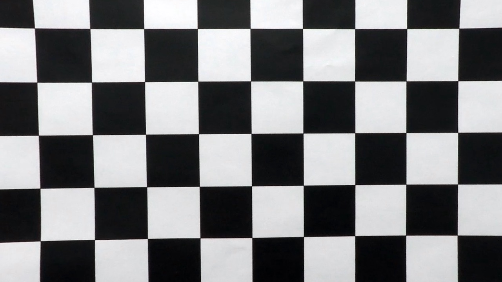|
| | 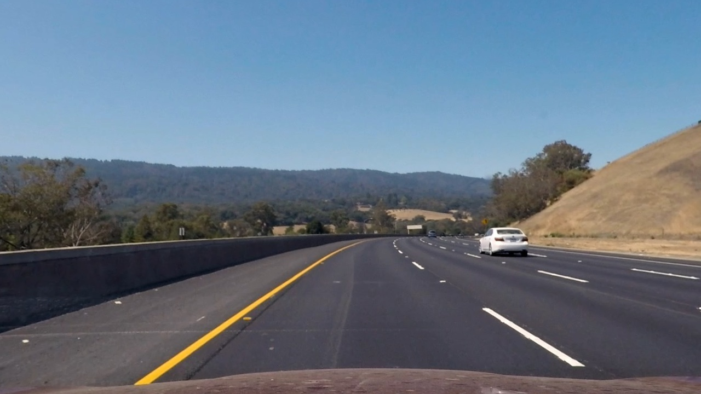|

### Image filtering

In order to identify the lane in an image, an input image (undistorted) is
filtered with respect to its pixel gradients and color values, and a
*binary-image* is returned. Following thresholds are applied.

1. Gradient threshold
  - Sobel filter on absolute value of pixels in x-axis is applied.
  - Sobel filter on both x and y-axis is applied and its gradients are
  thresholded with respect to the magnitude of scaled pixel values, scaled
  between 0 and 255.
  - Sobel filter along a given direction is applied on the gradients, targeted
   direction approximately sitting between _&pi;_/4 and _&pi;_/2.

2. Color threshold
  - Input image in RGB colorspace is converted to HLS (Hue, Light and Saturation)
  colorspace, where it is thresholded with respect to the Saturation channel
  (S-channel) values.

Above thresholding steps are carried out in `combined_threshold()` in
`src/vision_util.py`. Sample binary-images for images in test_images/ directory
obtained from this routine are saved in output_images/binary/ directory.

| Undistorted color image | Binary image after image-filtering |
|:-----------------------------------:|:-------------------------------------:|
| | 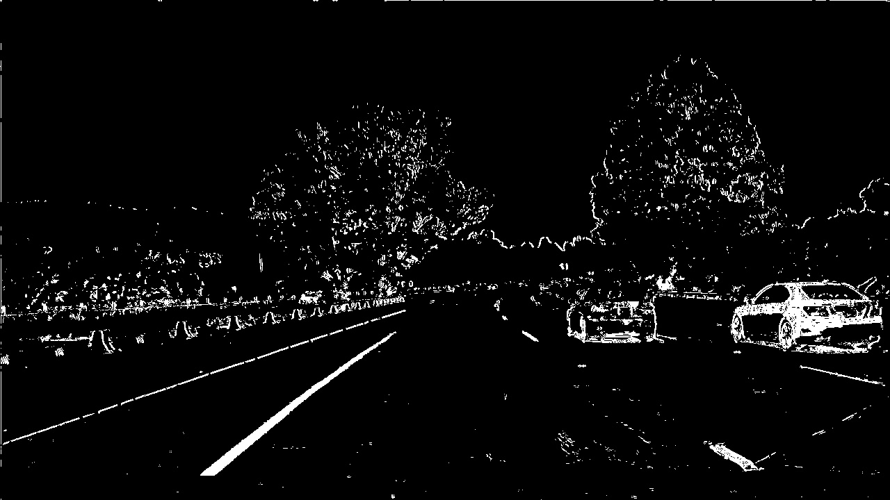|
| | 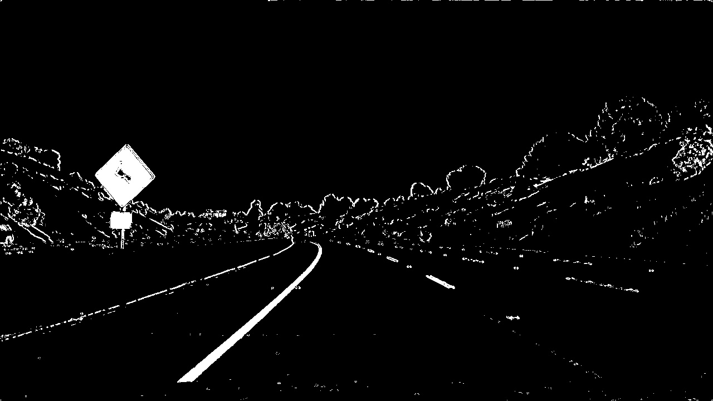|
| | 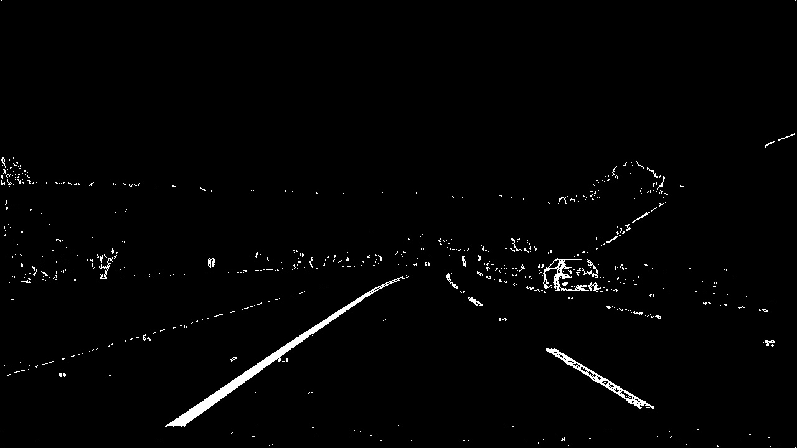|
| | 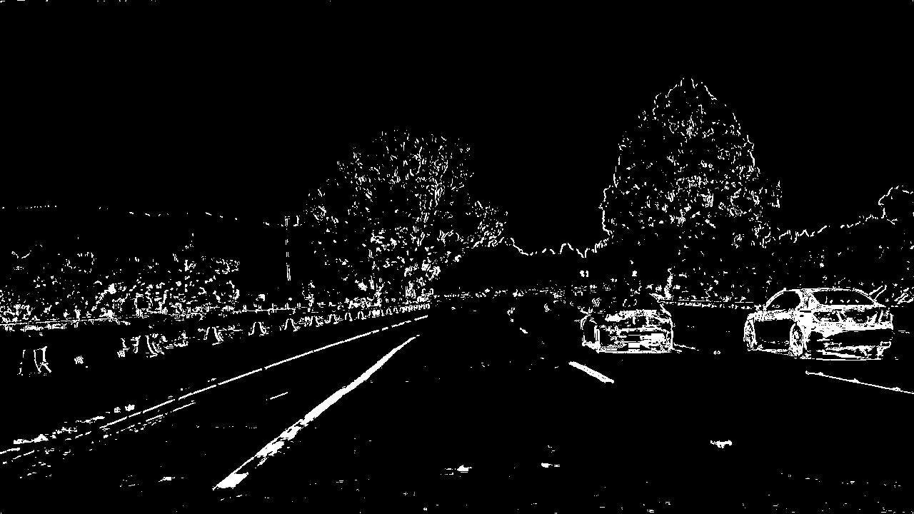|
| | |


### Image warping for bird's eye view

Binary image obtained from the above routine is warped to get a *bird's eye*
view on the lane, with which we can identify lane-lines and fit polynomials.
Perspective transformation is applied on the input image using OpenCV's
`getPerspectiveTransform(..)`. Steps that this routine captures:

1. A (hardcoded) region of interest (ROI), in form of a 4-sided polygon, in the
source binary image is selected.
2. ROI's four vertices are projected to rectangular coordinates with a random
offset (set to 100 pixels) in x-values of the pixels. This projection/mapping
gives us the perspective transformation matrix.
3. This transformation matrix is saved in a pickle file (`src/perspective_transform.p`)
for reuse.

Above steps are available in `vision_util.py` under `find_perspective_transform()`
function. Future use of the matrix involves calling OpenCV's `warpPerspective(..)`
function to warp the image. Sample warped binary images having bird's eye view
of the lane are stored in `output_images/binary_warped`.

| Filtered binary image | Warped binary image having bird's eye view |
|:-----------------------------------:|:-------------------------------------:|
| | 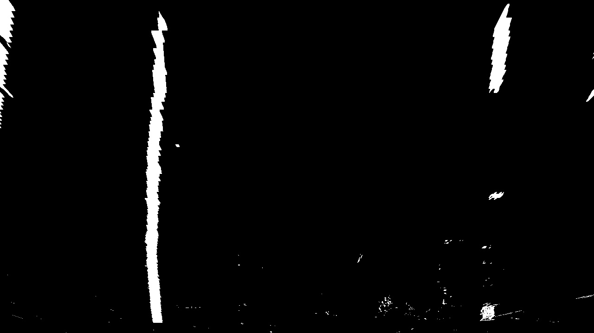|
| | 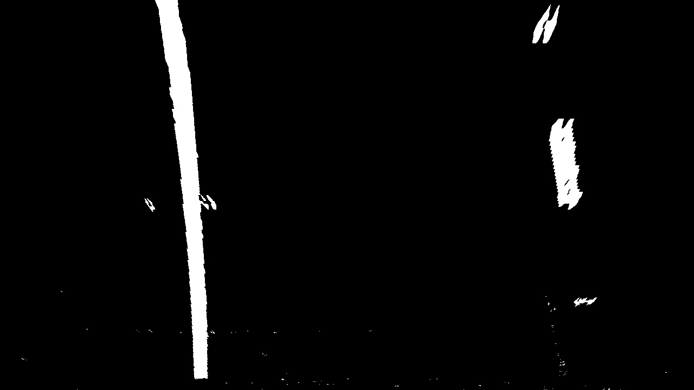|
| | 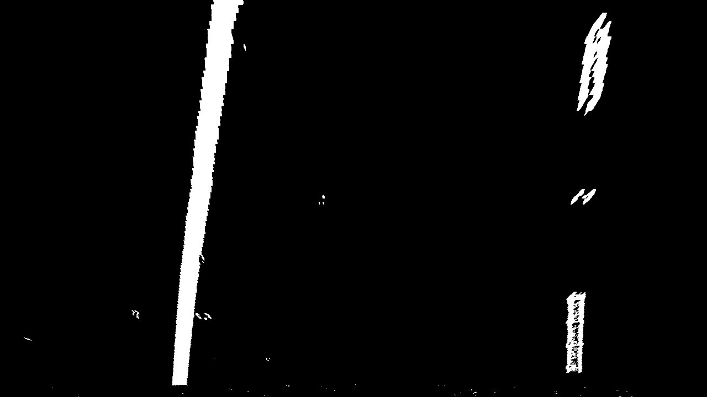|
| | 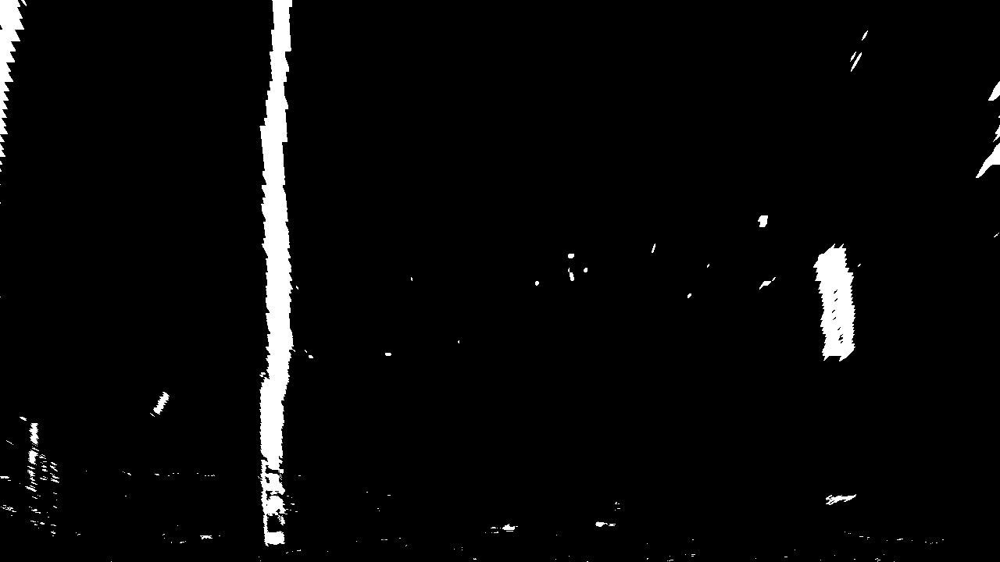|
| | |


### Lane detection and update

Once we have the warped binary image, we look for lane-lines doing the following:

1. Histogram of pixel intensities is found to find the starting x-indices of
left and right lane-lanes at the bottom part of the image.
2. By iterating through the image bottom-up through multiple windows, and by
making use of the starting indices obtained from the above step, left and
right lane-lines' pixel indices are found in the +/- 100 pixel-margin around the
previous windows' detections. Windows' centres belonging to left and right lane-
lines are adjusted in each iteration to represent the mean of their respective
detected-pixels' indices.
3. After collecting the lines' pixel indices, a second-order polynomial fit is
performed which gives us the equation of the lane-lines.

Above steps are performed in `src/vision_util`, `detect_lane_lines()` function.

Subsequent detections make use of the polynomial equations found above:

1. To do a targeted search in the region around the lane-lines' curve where
there's a high chance of finding/extending the lane-lines. This is carried out via
a *lane-line-update* routine, as present in `update_detected_lane()` function
in `src/vision_util.py`.
2. In addition to doing a targeted search, lane-lines' are smoothened by
performing a moving-average on their polynomial coefficients. This is done in
`src/line.py`'s `update_fit()` function, which makes use of eight image-frames
(utmost) to cache and average the coefficients.

| Sample warped binary image | Polynomial fit on lane-lines |
|:-----------------------------------:|:-------------------------------------:|
| | 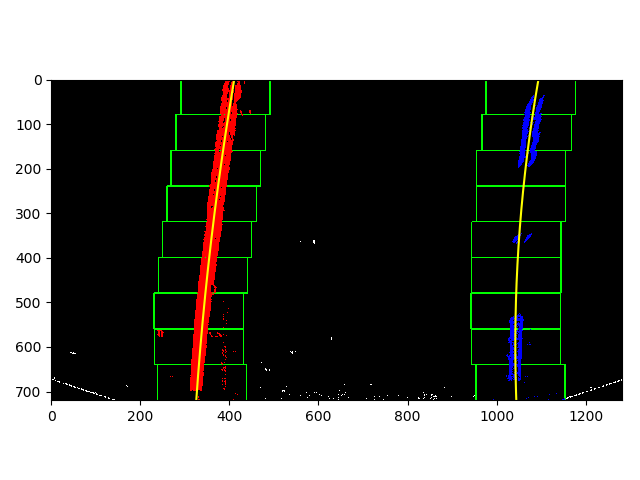|


### Lane curvature and vehicle-offset

Polynomial fits on lane-lines are made use of to compute the lane's radius
curvature and the vehicle's offset's from the lane-center. We make use of (known)
scaling factor which maps image resolution to metres in the world-space i.e.
3.6 metres per pixel in x-dimension and 30 metres per pixel in y-dimension.

1. `calculate_curvature()` in `src/vision_util.py` computes the curvature of the lane
as per the second-order differential equation mentioned
[here](https://www.intmath.com/applications-differentiation/8-radius-curvature.php).

2. `calculate_vehicle_offset()` in the same file computes the offset from finding
the difference between the lane-line's center and the image's center.

### Annotated source image with detected lanes

Once we find the lane-lines, we project back the lane-annotated version of the
image back to the original image as shown below. This is done via doing an
inverse perspective transform that we did earlier while warping for bird's-eye
view of the image.


Further we annotate the original image with the curvature and vehicle-offset
details. All these steps are carried out in `draw_lane()` function under
`src/vision_util.py`.

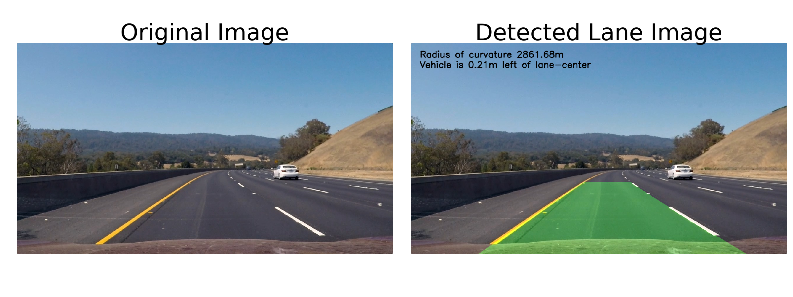

Finally, the above pipeline steps, except for camera-calibration are put together
in `lane_detection_pipeline()` function in `src/lane_detection.py`. This function
is run against an input stream of video [project_video.mp4](project_video.mp4),
and the output is saved in [detected_lane.mp4](detected_lane.mp4).

## Further improvements

Detection routine above is reliant on ROI to begin with. It'd make the pipeline
more robust if we look for pixel features representing lane-lines rather than
looking for lane-line pixels in an ROI. Making use of convolutional neural nets
along with RANSAC, as outlined in [this work](https://link.springer.com/chapter/10.1007/978-3-319-12637-1_57)
might improve the robustness of the detection-pipeline.
